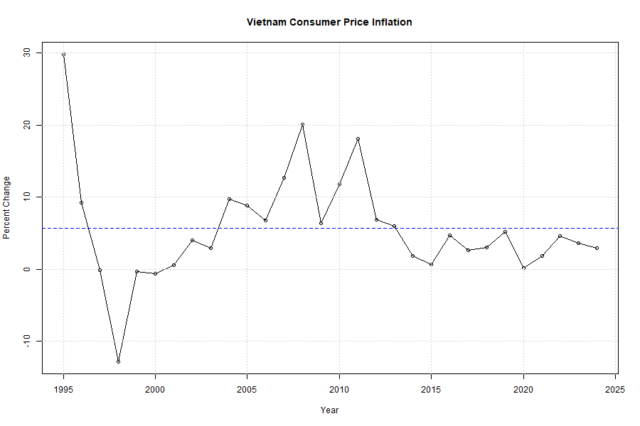
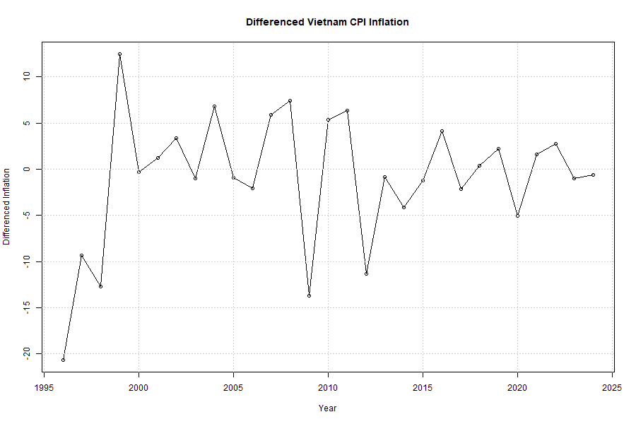
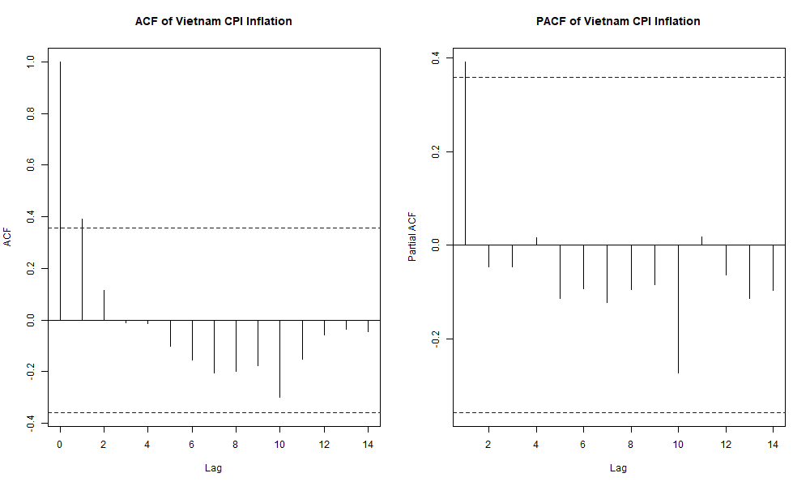
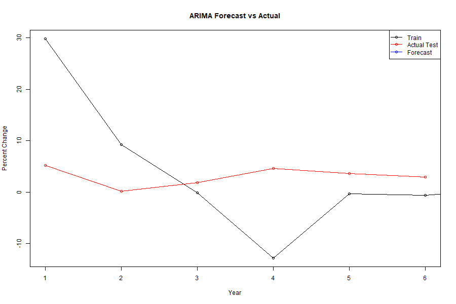
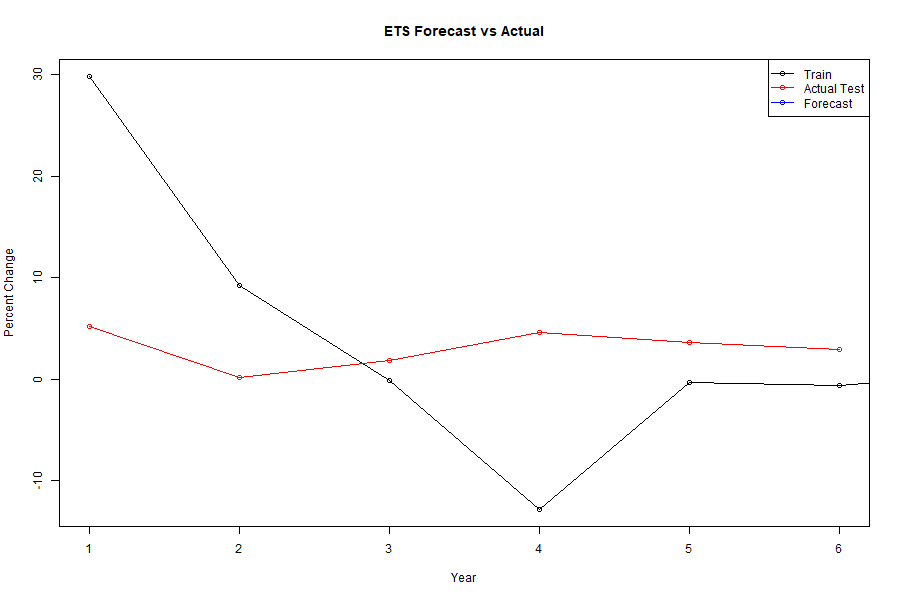
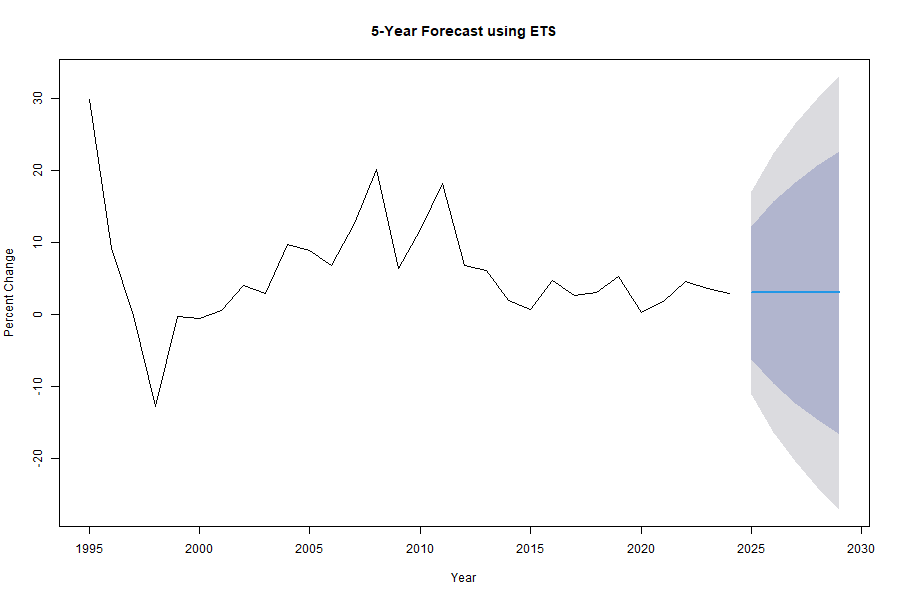

# vietnam-cpi-inflation-forecasting-in-r
A time series forecasting project in R analyzing and forecasting Vietnam’s annual CPI inflation using ARIMA and ETS models with FRED data.
# Vietnam CPI Inflation Forecasting in R

## Project Overview

This project analyzes and forecasts Vietnam’s annual Consumer Price Index (CPI) inflation using time series models in R.

I chose this topic because inflation is an important economic indicator. It affects purchasing power, financial planning, and the overall business environment. Forecasting inflation can help support better economic understanding and future planning.

---

## Dataset

The dataset used in this project is Vietnam’s annual consumer price inflation data from **FRED**.

- Period used: **1995 to 2024**
- Frequency: **annual**
- Variable: **CPI inflation (percent change)**

The data were cleaned by removing missing values and checking duplicate dates before converting them into a time series object.

---

## Methodology

The main steps of this project were:

- importing CPI data from FRED
- cleaning the dataset
- converting the data into a time series object
- performing exploratory analysis
- checking stationarity using the KPSS test
- applying first differencing
- plotting ACF and PACF
- splitting the series into training and testing sets
- building and comparing **ARIMA** and **ETS** models
- evaluating performance using **RMSE, MAE, and MAPE**
- selecting the best model
- forecasting the next 5 years

---

## Exploratory Analysis

### Vietnam CPI Inflation Series

This plot shows the annual CPI inflation trend in Vietnam over time.

### Differenced Series

The differenced series was used to examine changes more clearly and support stationarity analysis.

### ACF and PACF

#### Original Series

#### Differenced Series

These plots help identify possible autocorrelation patterns and support model selection.

---

## Model Comparison

Two forecasting models were used in this project:

- **ARIMA**
- **ETS**

Both models were trained on the training set and evaluated on the test set using:

- **RMSE**
- **MAE**
- **MAPE**

According to the results in the code, **ETS performed better than ARIMA** on the test set because it achieved lower RMSE and MAE values.

### ARIMA Forecast vs Actual

### ETS Forecast vs Actual

---

## Final Forecast

After comparing both models, the best model was fitted on the full dataset and used to generate a **5-year forecast**.

The forecast suggests that inflation may remain relatively stable over the next five years.

---

## Conclusion

This project shows how time series models in R can be used to analyze and forecast inflation. By comparing ARIMA and ETS, I found that ETS gave better forecasting performance for this dataset.

One important limitation is that the data are annual, so the number of observations is limited. In addition, ARIMA and ETS rely mainly on past values, which means they may not fully capture future policy changes or unexpected shocks.

---

## Tools and Libraries

- R
- quantmod
- forecast
- Metrics
- tseries
- ggplot2
